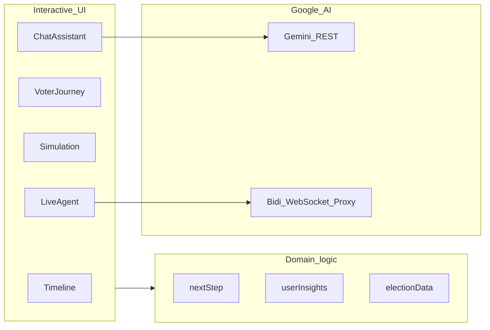
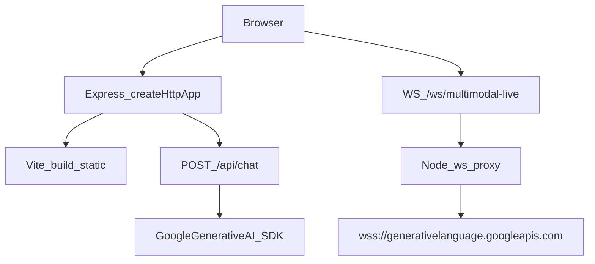

# VoteSetu — Interactive Indian Election Assistant

VoteSetu helps citizens understand **election timelines**, **registration**, **EPIC / voter ID**, **polling-day steps**, and **official concepts** (EVM, VVPAT, MCC) through guided UI, structured data, and an election-scoped assistant.

---

## Problem statement (hackathon)

> Create an assistant that helps users understand the election process, timelines, and steps in an **interactive** and **easy-to-follow** way.

### How VoteSetu maps to it

| Requirement | What we ship                                                                                 |
| ----------- | -------------------------------------------------------------------------------------------- |
| Interactive | Timeline phases, journey map, voting simulation, FAQ, chat assistant, optional live agent UI |
| Timelines   | Phase cards with durations, key dates, and glossary                                          |
| Steps       | Personalized **next-step engine** (`nextStep`, `userInsights`) driven by user profile        |
| Assistant   | REST streaming chat (`/api/chat`) + optional WebSocket bridge for Gemini Live-style flows    |

---

## Google services (what evaluators can verify in-repo)

| Google surface                          | Where it appears                                                                                 | Purpose                                                                            |
| --------------------------------------- | ------------------------------------------------------------------------------------------------ | ---------------------------------------------------------------------------------- |
| **Gemini (Generative AI)**              | `@google/generative-ai`, model id in `src/lib/googleGemini.ts`, calls in `src/server/httpApp.ts` | Election-bounded assistant answers over `/api/chat`                                |
| **Generative Language API (WebSocket)** | `getGenerativeLanguageBidiUrl()` in `src/lib/googleGemini.ts`, proxy in `src/index.ts`           | Secure server-side bridge to `generativelanguage.googleapis.com` for live sessions |
| **Google Cloud Run**                    | `Dockerfile` (non-root, healthcheck), `docs/GOOGLE_CLOUD.md`                                     | Managed HTTPS hosting for static + API + WS upgrade                                |
| **Artifact Registry + Cloud Build**     | `cloudbuild.yaml`, `.gcloudignore`                                                               | Reproducible image build and push for CI/CD                                        |
| **Google Fonts (optional UX)**          | `index.html` (`fonts.googleapis.com`)                                                            | Typography only — no voter data sent                                               |

**Tooling note:** Some teams use **Google Antigravity** or similar AI-assisted IDEs during development. That is a **workflow choice**, not a runtime dependency; production behavior is defined by this repository and Google Cloud deployment.

Full matrix: [docs/GOOGLE_CLOUD.md](docs/GOOGLE_CLOUD.md).

---

## Architecture (runtime)

- **Frontend**: React + Vite + Tailwind + Radix/shadcn patterns.
- **Backend**: `createHttpApp()` in `src/server/httpApp.ts` (testable HTTP surface); `src/index.ts` adds WebSocket upgrade and `listen`.
- **Safety**: Helmet, JSON size limits, rate limiting on chat, input length checks, CORS via `CORS_ORIGIN` when set.

---

## Quality, security, accessibility, tests

| Metric            | What we implemented                                                                            |
| ----------------- | ---------------------------------------------------------------------------------------------- |
| **Code quality**  | TypeScript + ESLint + optional Prettier; modular server (`httpApp`); centralized Gemini config |
| **Security**      | No secrets in Git (`.env` ignored); rate limits; helmet; validated chat payloads               |
| **Efficiency**    | Production build + chunk strategy in Vite; Docker multi-stage build                            |
| **Testing**       | Vitest + RTL + Supertest for HTTP API; coverage thresholds in `vitest.config.ts`               |
| **Accessibility** | Skip link, landmarks, focus styles, `eslint-plugin-jsx-a11y`, semantic headings/lists          |

CI runs install, lint, typecheck, coverage tests, and production build (`.github/workflows/ci.yml`).

---

## Repository layout (high level)

- `src/pages`, `src/components` — interactive voter experience
- `src/data/electionData.ts` — timeline, FAQs, EPIC helpers
- `src/lib/nextStep.ts`, `src/lib/userInsights.ts` — personalization
- `src/server/httpApp.ts` — Express app factory (used by tests + production)
- `src/index.ts` — HTTP server + WebSocket proxy wiring
- `cloudbuild.yaml` — Google Cloud Build entrypoint
- `Dockerfile` — Cloud Run–friendly container

---

## Disclaimer

Educational demo only — not affiliated with the Election Commission of India. Always confirm critical facts on **eci.gov.in** and official portals.

## License

MIT — see [LICENSE](LICENSE).
