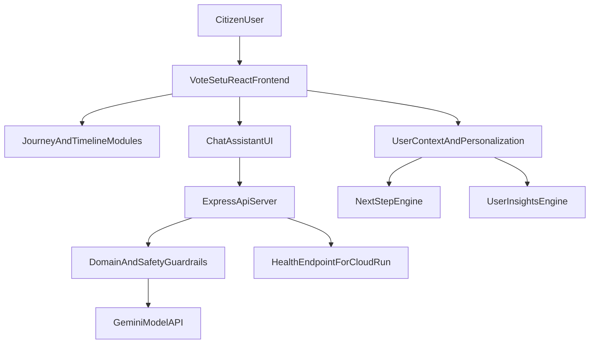

# VoteSetu

VoteSetu is an interactive election assistant focused on India. It helps users understand the election process, official timelines, eligibility, registration steps, EPIC guidance, and polling-day actions in a simple and actionable flow.


## Problem Statement Alignment

Problem statement:
- Create an assistant that helps users understand the election process, timelines, and steps in an interactive and easy-to-follow way.

How VoteSetu solves it:
- **Interactive and easy-to-follow guidance** through timeline cards, journey maps, simulation, FAQ, and chat assistant.
- **Election process clarity** with end-to-end phases from announcement to counting.
- **Actionable next steps** based on user profile (age, registration, EPIC status).
- **Official-source grounding** with citations to ECI and related public resources.

## End-to-End System Design



## User Guidance Flow


## Core Features

- Guided election timeline with role-based checklists (voter/candidate/official).
- Personalized voter journey and next-step recommendations.
- EPIC helper and validation with official references.
- AI chat assistant with election-only scope control.
- Voice/live assistant bridge (WebSocket).
- Multi-language content support.
- Accessibility-first UX patterns (skip links, keyboard-visible focus states, ARIA labels).

## What We Built

- **Election timeline intelligence** with phased process understanding and glossary.
- **Personalized voter planner** driven by `nextStep` and user state signals.
- **EPIC validation and support** for common voter ID scenarios.
- **Election-only AI assistant** with domain guardrails and refusal behavior for off-topic prompts.
- **Live interaction channel** for speech and multimodal assistant experiences.
- **Production-ready API** with health endpoint, input validation, and request controls.
- **CI quality gate** with linting, typecheck, test coverage, and build checks.

## Technology and Platform

- Frontend: React + TypeScript + Vite + Tailwind + shadcn/ui
- Backend: Express + WebSocket (`ws`)
- AI model integration: `@google/generative-ai`
- Testing: Vitest + Testing Library + Coverage thresholds
- Packaging/Deployability: Docker with healthcheck and non-root runtime
- Runtime target: Google Cloud Run

## Security Posture

- Secrets excluded from Git via `.gitignore` (`.env` not tracked).
- Request-size cap for JSON payloads.
- Basic per-IP rate limiting on chat API.
- Message length validation to reduce abuse risk.
- Security headers (`X-Frame-Options`, `X-Content-Type-Options`, `Referrer-Policy`).
- CORS configurable with `CORS_ORIGIN`.

## Google Services Used

- **Gemini API**: powers the election assistant response generation with domain constraints.
- **Google Cloud Run**: deployment target for scalable, managed container hosting.
- **Google Cloud Build compatibility**: Dockerized project can be built and deployed in GCP pipelines.

Google service clarity:
- **In use now**: Gemini API, Cloud Run.
- **Not currently integrated in this codebase**: any feature called "Google Antigravity".
- **Ready to extend**: can add other Google Cloud integrations if hackathon requires additional service touchpoints.

## Testing Strategy

- Unit tests for domain gate (`isElectionQuery`) and EPIC validation rules.
- Unit tests for next-step prioritization, greeting personalization, and user insight scoring.
- CI checks lint + test + build on every push/PR.
- Coverage thresholds enforced in Vitest configuration.

## Accessibility Checklist

- Keyboard navigation and focus-visible styling.
- Skip-to-content support.
- Meaningful ARIA labels on interactive controls.
- Semantic structure (`header`, `main`, `footer`, form controls).

## Repository Quality Signals (Hackathon AI Scrape)

- Clear README with architecture, flow diagrams, and evaluation mapping.
- Explicit problem-statement mapping.
- CI pipeline (`.github/workflows/ci.yml`).
- Environment template (`.env.example`).
- Deterministic quality checks for lint/typecheck/test/build.
- Health endpoint (`/healthz`) and container healthcheck for Cloud Run.

## AI Evaluation Checklist

- Code quality: lint clean, typecheck clean, strong utility module tests.
- Security: no committed secrets, rate limiting, input validation, restrictive headers, CORS control.
- Efficiency: multi-stage Docker build, production dependency install, static-asset build optimization.
- Testing: unit tests + coverage threshold + CI automation.
- Accessibility: semantic landmarks, keyboard support, skip links, ARIA labels.
- Google services readiness: Gemini integration, Cloud Run-ready runtime, health endpoint.
- Problem statement fit: election-specific guardrails + timeline + guided user journey + actionable assistant.

## Project Structure

```text
src/
  components/       UI + interactive assistant flows
  context/          global user state
  data/             election facts, timeline, EPIC rules
  i18n/             language support
  lib/              assistant/domain utility logic
  pages/            routed page views
  test/             unit tests
```

## Disclaimer

VoteSetu is an educational assistant and is not affiliated with the Election Commission of India. Users should verify critical details from official ECI portals.

## License

MIT
